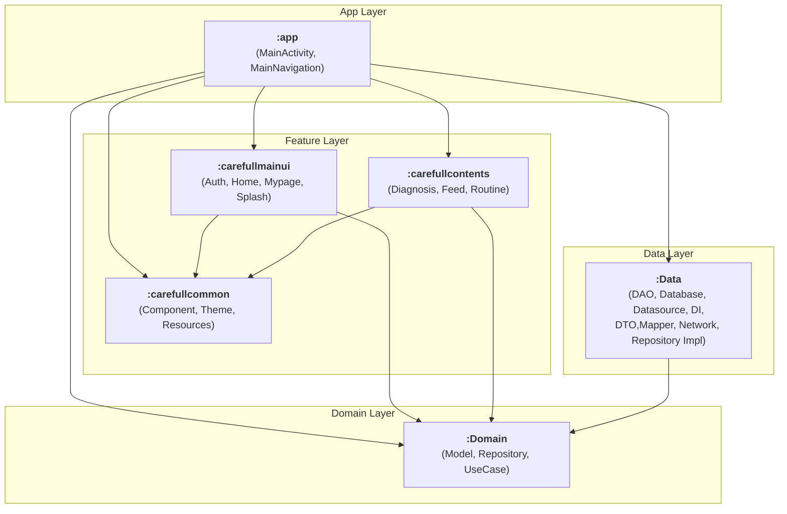

# CareFull

**"운동·식단 기록부터 건강 정보 검색까지, 하나의 앱으로 케어하세요"**

매일의 운동과 식단을 기록하고, AI로 증상을 분석하며 내게 필요한 건강 정보를 제공하는 통합 헬스케어 앱입니다."

## 🗂️ 프로젝트 개요

- **앱 이름** : CareFull
- **팀원** : 양정규(PEANUTBUTTER1001), 조해민(dptcldpa)
- **작업 기간** : 2025.06 ~ 마켓 출시 준비 중
- **플랫폼** : Android
- **개발 언어** : Kotlin
- **개발 환경** : Android Studio
- **외부API 및 서비스**
  - 공공데이터 API
  - Naver Maps
  - Kakao OAuth
  - ML Kit API
  - Firebase Firestore

## 🎯 서비스 목표

사용자의 운동·식단 습관화를 돕고, 개인의 상태를 분석하여 최적의 건강 정보를 제공함으로써 사용자 중심의 건강관리 서비스를 실현합니다.

## 🧰 기술 스택

| 분류             | 기술                                                        |
|----------------|-----------------------------------------------------------|
| Language       | Kotlin                                                    |
| Architecture   | MVVM, Clean Architecture(Hybrid)                          |
| Asynchronous   | Coroutine, Flow                                           |
| UI             | Jetpack Compose, Navigation, Coil                         |
| Network        | Retrofit2, OkHttp3, Interceptor, Moshi, Gson, tikxml      |
| SDK & API      | Kakao SDK, Naver Map SDK, Fused Location Provider, ML Kit |
| Authentication | KaKao OAuth                                               |
| DataBase       | Firestore, Room                                           |
| DI             | Hilt                                                      |
| ETC / Tools    | Figma, Github, Notion, Runtime Permission                 |

## 🏗️ 프로젝트 아키텍쳐

## ✨ 서비스 주요 기능

### 1. 로그인
||
|:---:|
| Kakao OAuth를 이용하여 계정을 관리합니다. |

### 2. 메인 화면
||
|:---:|
| 운동과 식단 활동이 달력에 표시됩니다. |

### 3. 운동 기록
||
|:---:|
| ML Kit API를 활용한 운동 자세를 인식합니다. |

### 4. 식단 기록
||
|:---:|
| 공공데이터 api를 활용하여 식단을 등록합니다. |

### 5. 챗봇
||
|:---:|
| 몸 상태를 챗봇에 질문 시 질환과 진료 과목을 추천합니다. |

### 6. 병원 검색

### 7. 질병, 약 검색
||
|:---:|
| 공공데이터 API를 활용하여 약을 검색합니다. |

### 8. 커뮤니티, 랭킹
|  |  |
|:---:|:---:|
| Firebase를 활용한 커뮤니티입니다. | 주간 간격으로 운동 종목별 운동 횟수로 순위를 나타냅니다. |

## 📊 데이터 셋

### 1. API 데이터

| 데이터 종류   | 활용 API                        | 제공 기관     | 주요 활용 목적    |
|----------|-------------------------------|-----------|-------------|
| 의약품 정보   | 의약품 제품 허가정보 API / 병용금기 정보 API | 식품의약품안전처  | 약 상세 정보 조회  |
| 병원 위치 정보 | 병원 정보 조회 API                  | 건강보험심사평가원 | 위치 기반 병원 검색 |
| 식품 영양 정보 | 식품영양성분 DB API                 | 식품의약품안전처  | 음식 영양 성분 분석 |
| 위치 정보    | 지도 SDK                        | Naver     | 현재 위치 안내    |

### 2. 사용자 생성 데이터

- **프로필 데이터** : 나이, 성별, 키, 체중, 활동량
- **운동 기록** : 운동종목, 횟수, 날짜
- **식단 기록** : 음식명, 음식 영양 성분, 섭취량, 날짜
- **소셜 활동** : 게시글, 댓글, 좋아요

### 3. 가공 및 시스템 생성 데이터

- **통계·분석 데이터** : 운동 빈도, 섭취 칼로리, 영양 비율

## 🚀 개선 목표

📷 Google Cloud Vision / ML Kit 을 활용한 음식,약 이미지 인식 및 운동 인식 정확도 개선

🔔 하루 루틴 미 입력 시 알림기능 추가

📃 누적된 일일 활동 데이터를 기반한 주간/월간 리포트
